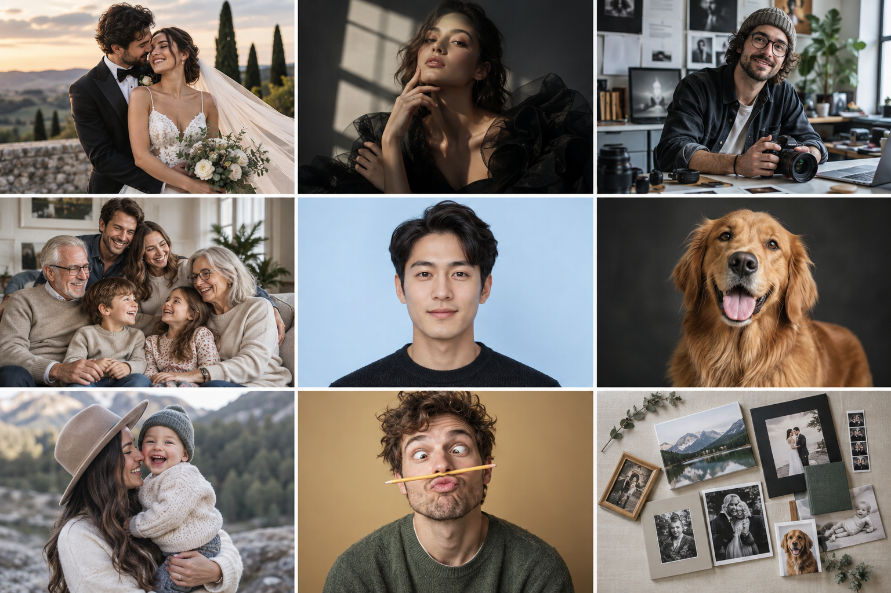

# 影像工坊

[English](./README.md) | 中文

影像工坊是面向影楼和人像摄影业务的 Agent Skill，帮助工作人员根据客户照片与需求制作选片预览、正式成片，或定向修改已有照片。明确规格的证件照直接生成；缺少关键规格时只集中问一次；全家福和亲子照先用一张横版四宫格比较方向，婚纱照、个人形象照和艺术写真先用一张九宫格比较方向，再决定是否制作单张成片。

核心流程覆盖证件照、婚纱照、全家福与亲子照、个人形象照和艺术写真。表情包、宠物写真与混合合集保留基础分流。

## 效果预览



从左到右、从上到下依次是：婚纱照、艺术写真、个人形象照；全家福、证件照、宠物写真；亲子照、表情包、混合合集。总览图使用 AI 生成的虚构人物说明支持范围，不代表真实客户案例，也不代表每类产品的最终交付版式。

## 适合谁使用？

- 需要把需求沟通、选片预览、质检和交付做成稳定流程的影楼。
- 为客户制作电子证件照、需要确定尺寸与底色的工作人员。
- 想先比较婚纱照场景、礼服与姿态的新人。
- 想比较四种场景和动作、同时保留所有指定成员的家庭。
- 需要职业、生活或人物特质表达的个人品牌用户。
- 需要可选建档、选片和正式交付记录的影楼。

## 它能做什么？

Skill 会一起理解照片与文字要求，保留每个人可辨认的身份，补全安全的默认项，只追问真正影响交付的缺失信息。证件照需求清楚时输出一张正式文件；全家福与亲子照默认先输出一张 2 × 2 四宫格，每格横版 4:3；婚纱照、个人形象照和艺术写真默认先输出一张 3 × 3 九宫格，每格竖版 3:4。直接修改现有照片的背景、服装、摄影风格或自然精修时，默认交付单张编辑结果。用户选中或认可某格，不代表自动制作单张高清成片。

| 能力 | 它能帮你做什么 |
| --- | --- |
| 证件照规格直达 | 将小一寸、一寸、小二寸、二寸等名称映射到明确尺寸，按要求处理底色与构图。 |
| 一张九宫格选方向 | 在一张图中比较婚纱、个人形象或艺术写真的九种方向，不一次生成九张单图。 |
| 全家福与亲子照四宫格 | 在一张图中比较四种横版场景和动作，同时保持每格的家庭成员完整。 |
| 人物与构图质检 | 保持脸部与真实身形，检查头顶、两侧留白、服装、手部及画格比例。 |
| 摄影导演与照片编辑 | 为创意人像安排可信的动作、场景和光线；按要求修改已有照片，并保留未指定的内容。 |
| 定向返修 | 只修改用户指出的问题，保留已确认的人物和其他画面内容。 |
| 可选影楼交付 | 只有正式套系需要时才使用建档、联系表、精确格式化与交付校验脚本。 |

## 平台兼容性

Markdown 规则面向 Codex、Claude Code 和 OpenClaw；能否生图取决于当前 Agent 可用的工具。可选 Python/Pillow 脚本使用跨平台路径，仓库 CI 已配置 macOS、Windows 和 Linux 检查。

## 安装

把下面这句话发送给你的 Agent：

```text
帮我安装这个 Skill：
https://github.com/chemny/photo-studio
```

Agent 会根据当前客户端完成安装、依赖检查和加载验证。

## 快速开始

上传一张清晰人像，然后说：

```text
请根据这张照片生成一张普通二寸蓝底证件照，保留我的五官和原有服装。
```

预期得到一张按对照表输出精确像素的证件照。用于考试、签证等正式申请时，请提供办理渠道及接收机构最新的像素、文件大小和底色要求；纸质照规格与线上上传要求可能不同，通用预设不能保证审核通过。

## 使用示例

```text
用这两张人物参考图做婚纱照。先给我一张九宫格比较方向，暂时不要生成单张成片。
```

```text
用这张清晰的全家合影做四种横版全家福方向。每格都保留全部成员，并明显改变场景和动作。
```

```text
用这张我和孩子的合影做亲子照四宫格。四格的活动要不同，保留我们的脸和年龄特征。
```

```text
给我做一组兼顾工作与生活的个人形象照，先出一张九宫格，每格保持同一个人。
```

```text
给我做艺术写真九宫格，布光和造型可以更有表现力，但脸仍要像我。
```

```text
保留这张参考图中的新娘，另外生成一位虚构的成年新郎，再做婚纱照九宫格。两人的面容在各格保持一致。
```

```text
把这张现有照片的背景换成明亮的摄影棚，保留我的脸、服装和姿势。
```

## 工作原理

[主规则](./SKILL.md)先识别照片类型，再调用对应的参考规范：[证件照尺寸对照](./references/id-photo-size-map.md)、[婚纱照](./references/wedding-photo.md)、[全家福与亲子照](./references/family-portrait.md)、[个人形象照](./references/personal-branding.md)和[艺术写真](./references/artistic-portrait.md)。[摄影导演规则](./references/portrait-direction.md)用于创意人像，[现有照片编辑规则](./references/photo-editing.md)用于局部处理。[流程回归用例](./references/workflow-acceptance.md)用于检查对话分流。普通概念预览不建立影楼目录；精确格式输出与正式套系交付才使用脚本。

## 仓库结构

```text
photo-studio/
├── SKILL.md
├── README.md
├── README.zh.md
├── LICENSE
├── agents/
├── assets/                 # 预设与业务总览图
├── references/             # 产品规则与质量检查
├── scripts/                # 可选格式化及交付工具
└── requirements.txt
```

## 运行要求

- 当前 Agent 有可用的图像生成或编辑工具；仓库提供工作流和辅助脚本，不内置图像模型。
- 精确格式化或正式影楼交付需要 Python 3.10+ 与 Pillow。
- 提供清晰的人物参考图；正式证件照用途最好同时提供接收机构最新要求。

## 协议

本仓库采用 MIT License，详见 [LICENSE](./LICENSE)。该协议不授予用户上传照片或第三方素材的使用权。
